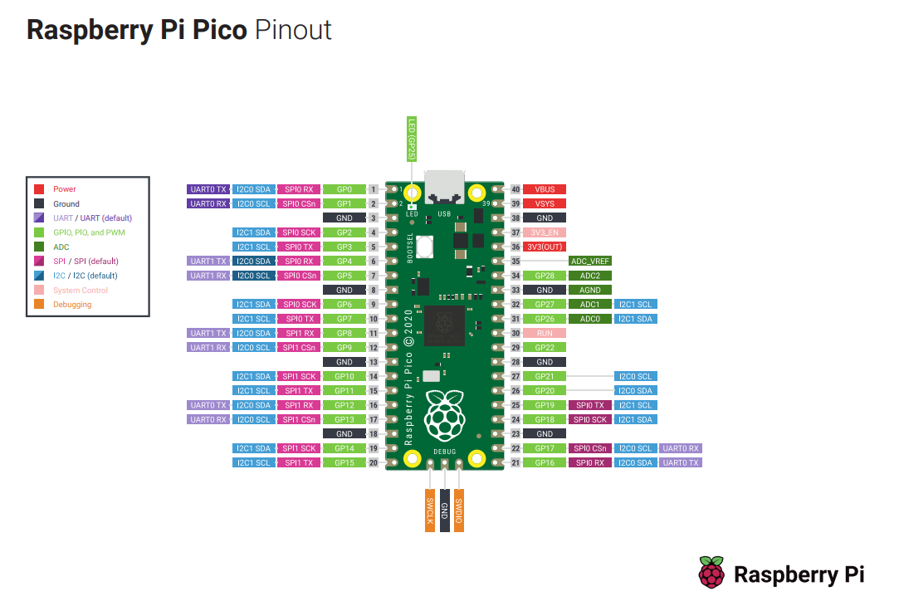

# WRC Fiesta Race Wheel Software
By Matthew Hait & Gabe Carnes

Softare for USB sim racing steering wheel running on FreeRTOS.

## GPIO BOM

### User Inputs

- 12 - Buttons
  - OP: One output each
  - GPIO: GP2-13
- 3 - Encoder Buttons
  - OP: One output each
  - GPIO: GP14-16
- 2 - Momentary Toggle Switches
  - OP: Two outputs each
  - GPIO: GP0-1, GP26-27 
- 3 - Encoders
  - PN: Encoder_CTS-288T232R161A2
  - OP: Two-bit encoder, Two outputs, Interrupts needed
  - GPIO: GP18-22,GP28
### Other
  
- Internal Temp Sensor
  - OP: P.589 RP2040 Datasheet 
  - GPIO: ain_sel #4

### Outputs
- USB HID Gamepad
  - TinyUSB:
    - See examples "pico-examples\usb\device\dev_hid_composite" 
    - https://github.com/hathach/tinyusb/tree/master/src/portable/raspberrypi/rp2040
    - https://github.com/hathach/tinyusb/tree/master/examples/device/hid_composite_freertos
  - CDC ACM port
  - DMA if used: https://www.youtube.com/watch?v=-Wh3SIAl0Ic
  - GPIO
    - https://raspberrypi.github.io/pico-sdk-doxygen/group__hardware__gpio.html
### Tasking
- FreeRTOS
  - https://github.com/smittytone/RP2040-FreeRTOS

----------------------
### Commands I forget
- export PICO_SDK_PATH=/mnt/c/Users/PoisonGryphon/Documents/My\ Files/proj/pico/pico-sdk/
