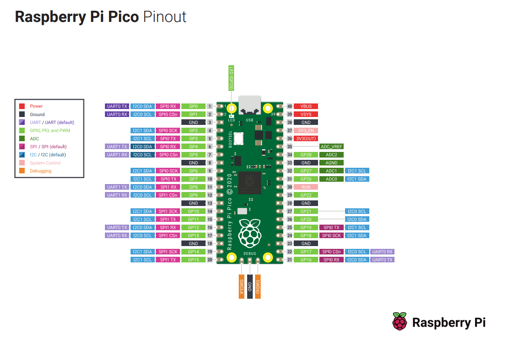

#Race Wheel Software
By Matthew Hait

##GPIO BOM

###User Inputs

- 12 - Buttons
  - OP: One output each
  - GPIO: GP2-13
- 5 - Encoders
  - PN: Encoder_CTS-288T232R161A2
  - OP: Two-bit encoder, Two outputs, Interrupts needed
  - GPIO: GP14-21,GP22,GP28
- 2 - Paddles (Buttons)
  - OP: One output each
  - GPIO: GP0-1 **Move to save UART for future projects**
- 2 - Hall Effect for clutch
  - OP: Analog
  - GPIO: 26, 27
- 1 - Multi-direction Switch
  - PN: RKJXT1F
  - OP: 4 POS + rotate + press
  - GPIO: **TBD**
###Other
  
- Internal Temp Sensor
  - OP: P.589 RP2040 Datasheet 
  - GPIO: ain_sel #4

###Outputs
- USB HID Gamepad
  - TinyUSB:
    - See examples "pico-examples\usb\device\dev_hid_composite" 
    - https://github.com/hathach/tinyusb/tree/master/src/portable/raspberrypi/rp2040
    - https://github.com/hathach/tinyusb/tree/master/examples/device/hid_composite_freertos
  - CDC ACM port
###Tasking
- FreeRTOS
  - https://github.com/smittytone/RP2040-FreeRTOS

----------------------
### Commands I forget
- export PICO_SDK_PATH=/mnt/c/Users/PoisonGryphon/Documents/My\ Files/proj/pico/pico-sdk/